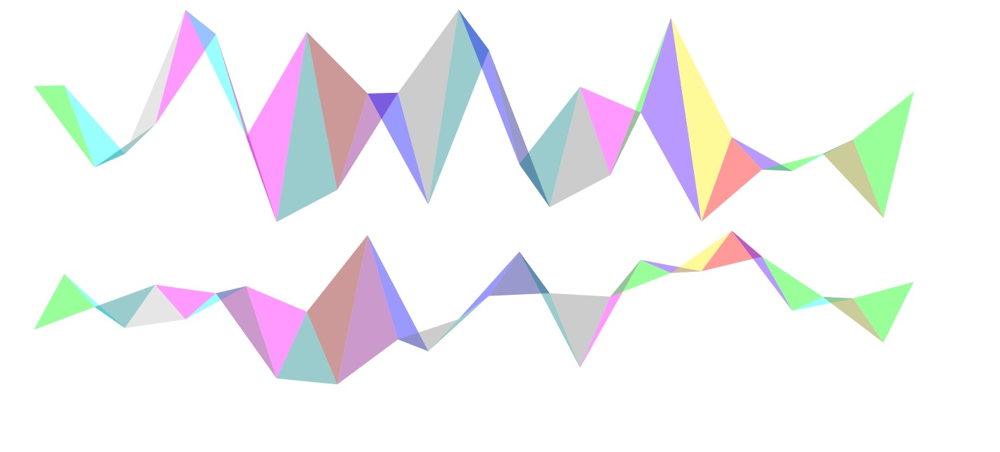

# Lock Down
Lock Down is a game to simulate the practicing of social distancing during this Corona Virus(COVID19) pandemic. 
Hope you enjoy it.  

Explanation
-----------
The yellow node represents a healthy person(you).  
The purple nodes represent infected/sick people.  
You must navigate from the left wall of the window to the right wall of the window without touching any infected/sick nodes(or the linked lines between sick/infected nodes). 
Failure to do this results in a GAME OVER.  
Move across the canvas with your keyboard arrow keys.  
Pause the game by pressing the ESC button on your keyboard. 

 
## Getting Started

These instructions will get you a copy of the project up and running on your local machine for development and testing purposes. 

### Prerequisites

All you'll ever need is a working web browser. That's it.

### Installing
Open the index.html file in your web browser. It's that simple. Enjoy the game.  
 
## Built With

* Javascript. 
* jQuery
* Twitter Bootstrap : https://getbootstrap.com/
* Select2 : https://select2.org/  

## Authors 

* **Caleb Nii Tetteh Tsuru Addy(Virus)**   
 
## License

This project is licensed under the GNU General Public License v3.0.
